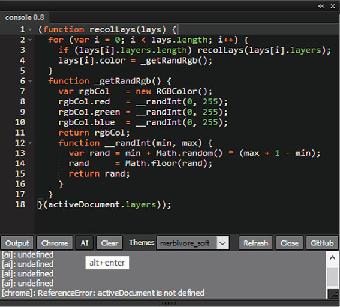

HTML/CSS/JS Extension Panel for Adobe Illustrator CC+
===

---

Editor and console to enter and run JavaScript code
---

* JavaScript editor based on [ACE](https://ace.c9.io/#nav=about) editor.
* The result of the script execution is displayed in the console.
* as ExtendScript in the Illustrator environment
* as JavaScript in environment of the extension panel inbuilt Chrome-browser

---

---

Description:
---

* enter js-code in text field
* enter `ctrl+enter` shortcut (or button `Ai`) to run code in `Illustrator`
* enter `alt+enter` (or `cmd-enter` for Mac) shortcut (or button `Chrome`) to run code in extension panel
  inbuilt `Chrome-browser`
* `Clear` button clears the output bottom field
* `Refresh` button clears all
* `Close` button upload the panel
* set the color theme of syntax highlight from the `Themes` list

---

Version history
---

### 0.9.1

* refactored layout
* updated Ace version
* added ~10 new themes
* added code completetion

### todo:
* remove jquery library
* replace themeManager.js to themisation with css variables
* add save panel state - theme and other settings
* add other Ace futures

