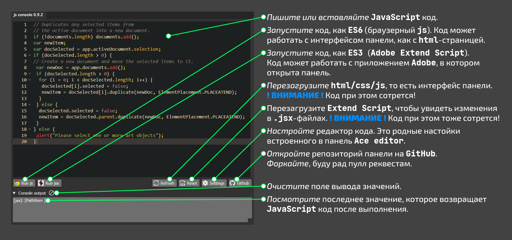

HTML/CSS/JS панель расширения для тестирования небольших кусков JS кода.
===

### Прямо не отходя от кассы в Illustrator, InDesign и Photoshop `версий CC 2019++` 

---

* Я взял редактор кода - [Ace editor](https://ace.c9.io/#nav=about).
* Работает все очень просто:
  * Yаписали или вставили свой JavaScript код.
  * Нажали на кнопку `Run js` или `Run jsx`:
    * `Run js` - код выполнится на странице index.html. Это страница, которую мы видим, как интерфейс панели. При этом
      ваш код должен соответствовать стандарту языка ECMAScript6 (ECMAScript5 - для устаревших версий приложений Adobe)
    * `Run jsx` - код выполнится в окружении приложения Adobe. При этом ваш код должен соответствовать стандарту языка
      Adobe Extend Script (ECMAScript3 дополненный Adobe).
  * Посмотрели результат выполнения кода в панели `Console output`;
  * Запустили браузер `Chrome` для работы в консоли разработчика (по
    адресу http://hostscript:7770 - Иллюстратор, http://hostscript:7771 - ИнДизайн и http://hostscript:7772 -
    Фотошоп).
* Кнопка `Settings` - откроет родные встроенные в [Ace editor](https://ace.c9.io/#nav=about) настойки:
  * выбор темы;
  * автодополнение;
  * выбор языка ( **!!!** подсветка и автодополнение будет работать только для js, html, css);
  * разное.
* Настойте и кликните в любом свободном поле панели - настойки применятся и запомнятся.
* Посмотрите [демо](https://ace.c9.io/build/kitchen-sink.html) настроек, чтобы понять, что к чему.
* Я включил шоткаты:
  * Красиво переформатировать код - `Ctrl` + `Alt` + `L`.
  * Свернуть весь код `Ctrl` + `Shift` + `-`.
  * Развернуть весь код `Ctrl` + `Shift` + `+`.
  * Пререндерить окно редактора `Ctrl` + `Shift` + `R` ( **!!!** только для Illustrator 2022 и ниже).
* Код в окне редактора сохраняется после закрытия.

---

---

### Мысли, планы

* Есть [несколько крутых редакторов](https://js.libhunt.com/ace-alternatives), которые можно использовать вместо
  `Ace editor`.
* Хочется кнопку, которая будет делать вкладки и в каждой вкладке своя независимая копия редактора.
* Хочется, наверное, иметь где-то историю сессий.

### Это не знаю, как сделать

* Перехватывать `$.writeln()` и выводить в консоль панели.
* Прикрутить автодополнение и проверку синтаксиса `Extend Script` и `DOM` `Ai`, `Indd` и `Psd`.
* Если кто знает, колитесь! )))

### История версий

* 1.0.0
  * Релиз с минимальным функционалом

* 1.0.1 
  * Изменение описани в README.md
  * Удалены неиспользуемые компоненты Ace editor

### Благодарности
Спасибо участникам телеграм-группы `CodeGraphics` и особо Sergey Osokin за отзывы и тестирование.