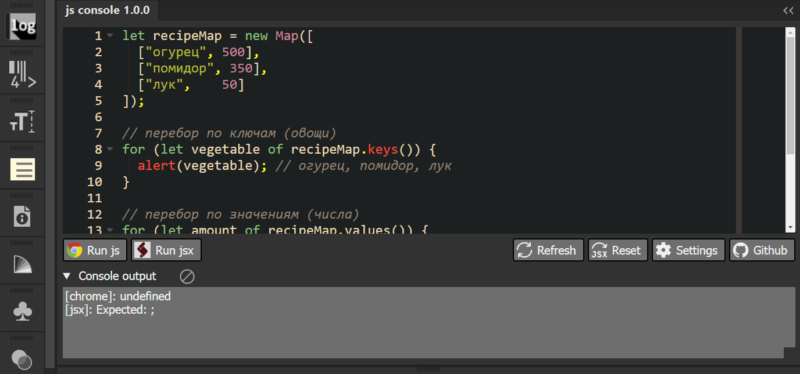

`HTML/CSS/JS` панель расширения для тестирования небольших кусков `JavaScript` кода. Прямо в `Adobe Illustrator`, `InDesign` или `Photoshop`, не отходя от кассы
===

---
### К слову сказать, панель можно использовать для тестирования `html` и `css`. Для этого в настойках (кнопка `Settings`) надо выставить соответствующий язык. Там их много, но в эту редакцию включены только `html`, `css` и `javascript`

---

* Редактор кода - [Ace editor](https://ace.c9.io/#nav=about).
* Работает все очень просто:
  * написали или вставили `JavaScript` код;
  * нажали на кнопку `Run js` или `Run jsx`;
  * `Run js` - код код будет работать с интерфейсом панели, как с веб- страницей.
  * `Run jsx` - код выполнится, как Adobe ExtendScript (ES3) в окружении того приложения Adobe, в котором открыта панель.
  * посмотрели результат выполнения кода в панели `Console output`;
  * так же можно запустить браузер Chrome и экспериментровать с интерфейсом в панели разработчика (по адресу http://hostscript:7770 - для Иллюстратора, http://hostscript:7771 - для ИнДизайна и http://hostscript:7772 - для Фотошопа).
* Настройки - это "родные", то есть встроенные в [Ace editor](https://ace.c9.io/#nav=about) настойки:
  * выбор темы;
  * автодополнение, которое будет работать для JavaScript, CSS или HTML;
  * выбор языка (выбирайте JavaScript, CSS или HTML);
  * и некоторые другие настройки;
  * настойте и кликните в любом свободном поле панели - настойки применятся и запомнятся.

---

---

### Планы
Сделаю, допишу, подключу все что делается быстро и легко, без фанатизма ;)

### Pull Request (Merge Request)
  * Залетайте на [GitHub](https://github.com/dumbm1/ai_id_ps_console)
  * Форкайте
  * Обязательно ответвляйтесь от ветки master в тематическую ветку (название ветки - что собитаетесь исправить, сделать, поменять)
  * Присылайте пулл реквесты

### Мысли
  * Есть [несколько крутых редакторов](https://js.libhunt.com/ace-alternatives), которые можно использовать в панели вмето Ace editor.
  * Еще хочется сделать несколько вкладок (может даже динамически создавать) и в каждой вкладке будет своя копия редактора и свои настойки (тема, язык и тп).
  * Хочу сделать, чтоб последний введенный код не стирался, а болтался в окне редактора, пока я сам его не сотру (как сейчас во всех текстовых редакторах).
  * Так же хочу сделать историю (все через LocalStorage, поэтому полной сохранности гарантировать нельзя, но хотя бы так).
